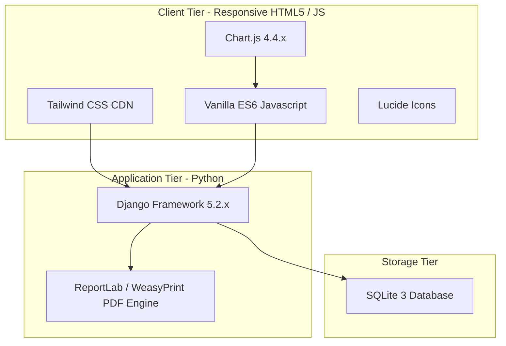

# <p align="center">🚚 TransitOps ERP</p>
<p align="center"><strong>Smart Transport Operations Platform</strong></p>

<p align="center">
  
  
  
  
  
  
</p>

<p align="center">
  
  
</p>

<p align="center">
  <strong>Manage Fleet. &bull; Dispatch Smarter. &bull; Reduce Cost. &bull; Increase Efficiency.</strong>
</p>

---

## 📖 About Project

**TransitOps ERP** is an enterprise-grade, role-based Transport Management System (TMS) and Enterprise Resource Planning (ERP) platform designed specifically to modernize, digitize, and optimize logistics and fleet operations. Built with a high-performance **Django** backend and a responsive, polished **Tailwind CSS** frontend, the system addresses the critical inefficiencies that plague traditional logistics businesses: manual scheduling, lack of operational transparency, driver downtime, paper-based compliance, and unmonitored fuel leakage.

### The Business Problem
Modern fleet operators struggle with fragmented workflows. Fleet managers track vehicle updates on physical boards or Excel sheets; drivers receive trip updates over phone calls; safety officers scramble to verify commercial drivers license expirations; and financial analysts manually tally crumpled fuel bills. This fragmentation results in:
* **Asset Underutilization:** Vehicles sit idle due to lack of consolidated dispatch scheduling.
* **Loss Control Issues:** Fuel theft and excessive maintenance overheads go unnoticed.
* **Compliance Risks:** Unlicensed drivers operating heavy cargo trucks, leading to huge legal penalties.
* **Operational Inefficiencies:** Extreme delays in coordination between drivers, dispatchers, and management.

### The TransitOps Solution
TransitOps ERP eliminates operational silos by establishing a centralized dashboard command console powered by **Role-Based Access Control (RBAC)**. The platform digitalizes the entire transportation value chain:
1. **Vehicle Management:** Centralized asset logs tracking chassis details, odometer progress, maintenance schedules, and active statuses.
2. **Driver Management:** Operator directory mapping profiles, safety scores, contact info, and licensing validity.
3. **Trip Dispatching:** Optimized source-to-destination routing, ETA schedules, driver allocations, and cargo load tracking.
4. **Maintenance Monitoring:** Preventive diagnostic check schedules, component lifetime tracking, and high-priority repair flags.
5. **Fuel Tracking:** Gas refuel receipt submissions, real-time efficiency metrics, and consumption logging.
6. **Expense Management:** Invoice logging, ledger audits, toll charges, and vendor payment tracking.
7. **Operational Analytics:** Profitability charts, vehicle-level ROI breakdown, and fuel expenditure trends.

---

## ⚡ Features

TransitOps is loaded with professional features tailored to enterprise needs:

| Feature Area | Key Capability | Business Impact |
| :--- | :--- | :--- |
| **Authentication & RBAC** | Secure role gateway for Admin, Fleet Manager, Driver, Safety Officer, and Finance Executive. | Prevents unauthorized data access; limits operations to verified roles. |
| **SaaS Dashboard Hub** | Dynamic console featuring context-sensitive KPIs, recent dispatches, and quick action logs. | Real-time overview of entire business operations at a glance. |
| **Vehicle Registry** | Asset inventory ledger mapping odometer counts, fuel levels, and current vehicle statuses. | Eliminates manual vehicle checkouts and improves utilization. |
| **Driver Management** | Clean roster tracker with automated safety score calculation and license expiration monitors. | Promotes safe driving habits and keeps operators compliant. |
| **Trip Dispatching** | Interactive route assignments, live status transitions, ETA monitors, and load checks. | Reduces vehicle empty miles and optimizes dispatch latency. |
| **Maintenance Logger** | Component check schedules, service history tracking, and high/medium priority flags. | Extends asset longevity; reduces sudden breakdowns. |
| **Fuel Log Submissions** | Driver-side gas bill uploads, receipt attachments, and automatically calculated fuel efficiency. | Highlights fuel leaks and cuts down administrative overhead. |
| **Expense Tracking** | Auditable invoice ledger with status badges (Paid, Pending, Overdue), categories, and pagination. | Simplifies bookkeeping and identifies cost savings. |
| **Reports Center** | Period-based P&L statements, fleet cost summaries, and budget variance audits. | Provides stakeholders with instantly exportable summaries. |
| **Advanced Analytics** | High-fidelity interactive line, bar, pie, and radar charts powered by Chart.js. | Data-driven decision making for fleet managers and executives. |
| **Document Management**| Cloud-ready digital storage for physical license uploads and medical verification logs. | Ensures compliance files are always auditable. |
| **Dark Mode Toggle** | System-wide dark/light theme switch persisting across sessions. | Reduces eye strain for operators working night shifts. |
| **Export Utilities** | Clean CSV and PDF exports for all ledgers and financial reports. | Streamlines external audits and regulatory submissions. |
| **Responsive UI** | 100% responsive, mobile-first design with a collapsible navigation sidebar. | Allows field staff and drivers to operate seamlessly on any device. |

---

## 📸 Screenshots

### 🖥️ Dashboard Overview
> 

---

### 🚛 Vehicle Registry Module
> 


---

### 👨‍✈️ Driver Management Directory
> 


---

### 🛣️ Trip Dispatcher Console
> 


---

### 🔧 Maintenance Logs
> 


---

### ⛽ Fuel Transactions & Bills
> 


---

### 📊 Finance Analytics Panel
> 


---

### ⚙️ System Settings
> 


---

## 🛠️ Tech Stack



* **Backend Engine:** Python 3.11+ / Django 5.2.x
* **Database Engine:** SQLite 3 (Default, easily configurable to PostgreSQL/MySQL)
* **Frontend Design:** Tailwind CSS CDN (Utility-first styling system) & Custom CSS variables
* **UI Interactions:** Vanilla Javascript (ES6 modular classes)
* **Data Visualization:** Chart.js (Interactive charts)
* **Icon Framework:** Lucide Icons (CDN)
* **Document Exporter:** ReportLab / WeasyPrint (Automated PDF reports)

---

## 📂 Folder Structure

```
TransitOps/
├── config/                  # Django project configuration settings
│   ├── __init__.py
│   ├── asgi.py
│   ├── settings.py          # Database, session, and app registrations
│   ├── urls.py              # Root routing table
│   └── wsgi.py
├── accounts/                # User authentication and profile management
│   ├── migrations/
│   ├── __init__.py
│   ├── admin.py
│   ├── apps.py
│   ├── models.py            # User and Role schema models
│   ├── urls.py
│   └── views.py             # Login, logout, and registration controllers
├── dashboard/               # Main entrypoints and portal views
│   ├── migrations/
│   ├── __init__.py
│   ├── urls.py
│   └── views.py             # Dashboard widgets dispatchers
├── transport/               # Core business logic (Fleet, Trips, Maintenance, Fuel)
│   ├── migrations/
│   ├── __init__.py
│   ├── admin.py
│   ├── models.py            # Fleet, Trip, FuelLog, Maintenance models
│   ├── urls.py
│   └── views.py             # Operational logic controllers
├── templates/               # Django HTML Templates (Modular, Django Template Language)
│   ├── base.html            # Main template skeleton with nav structure
│   ├── auth/                # Login and register pages
│   ├── fleet_manager/       # Fleet manager workspace
│   ├── driver/              # Driver dashboard templates
│   ├── safety_officer/      # Compliance and licenses templates
│   └── finance/             # Expense ledgers and analytics views
├── static/                  # Shared static assets (CSS, JS, Images)
│   ├── css/
│   │   └── style.css        # TransitOps ERP theme and table token layout
│   └── js/
│       └── script.js        # Session routing, Lucide indicators, Chart configs
├── media/                   # Uploaded media assets (Fuel receipts, documents)
├── manage.py                # Django CLI entrypoint
├── requirements.txt         # Project software dependency list
└── README.md                # System documentation
```

---

## 📥 Installation

Follow these steps to run TransitOps ERP locally:

1. **Clone the repository:**
   ```bash
   git clone https://github.com/jayraychura/transitops.git
   cd transitops
   ```

2. **Create and activate a Python virtual environment:**
   ```bash
   # Windows PowerShell
   python -m venv venv
   .\venv\Scripts\Activate.ps1

   # Linux/macOS
   python3 -m venv venv
   source venv/bin/activate
   ```

3. **Install project dependencies:**
   ```bash
   pip install --upgrade pip
   pip install -r requirements.txt
   ```

5. **Apply database schema migrations:**
   ```bash
   python manage.py makemigrations
   python manage.py migrate
   ```

6. **Seed demo enterprise data (Optional but recommended):**
   ```bash
   python manage.py seed_demo_data
   ```

7. **Start the local development server:**
   ```bash
   python manage.py runserver
   ```
   Open your browser and navigate to `http://127.0.0.1:8000` to access the platform.

---

## 🔑 Demo Credentials

Use the following mock accounts to test different role interfaces during execution:

| Role | Username | Password | Key Permissions / Dashboard Focus |
| :--- | :--- | :--- | :--- |
| **Super Admin** | `admin` | `admin123` | Complete access to user registrations and configurations. |
| **Fleet Manager** | `alex_manager` | `fleet123` | Fleet status, Driver assignments, Maintenance scheduling. |
| **Driver** | `marcus_driver` | `driver123` | Route tracking, odometer checks, fuel receipt submission. |
| **Safety Officer** | `sarah_safety` | `safety123` | Commercial Driver Licenses checks, Incident logs, Audits. |
| **Finance Executive** | `jordan_finance` | `finance123` | Ledger accounting, fuel costs audit, P&L statements. |

> [!WARNING]
> Default passwords are provided for evaluation purposes only. Be sure to change them and set a secure `SECRET_KEY` in `settings.py` before deploying to a production server.

---

## 📜 Business Rules

TransitOps ERP operates under a strict set of business rules enforced at the application tier:

<details>
<summary>🔍 Click to view business rules details</summary>

### 1. Registration Security
* Every vehicle registration plate must be unique and match standard regional formats. Duplicate entries are blocked.
* Every driver profile must link to a unique, verified license document.

### 2. Vehicle Capacity Validation
* During dispatch creation, if the assigned cargo load weight exceeds the vehicle's maximum payload capacity, the system blocks the dispatch and raises a validation alert.

### 3. Driver & Vehicle Availability Validation
* A driver cannot be assigned to an active trip if they are currently status-marked as `On Trip` or `Suspended`.
* A vehicle cannot be dispatched if it is currently flagged as `In Maintenance` or has an active `Out of Service` status.

### 4. Automatic Status Transitions
* Starting a trip sets the driver status to `On Trip` and vehicle status to `Active`.
* Completing a trip automatically switches both driver and vehicle status back to `Available`.
* Scheduling a maintenance request transitions the vehicle status to `In Maintenance`.

### 5. Maintenance Safety Controls
* Preventive maintenance warnings are triggered automatically when a vehicle's odometer exceeds 10,000 km since its last recorded service.

### 6. Fuel Receipt Audit Controls
* Drivers must submit a physical image upload of their gas receipt whenever logging a fuel refill. Odometer values entered during fuel log creation must exceed the previous odometer log values.

### 7. Expense Approval Workflows
* Any individual maintenance invoice or fuel expenditure exceeding $5,000 requires explicit approval status validation by a Financial Analyst before hitting the general ledger.

</details>

---

## 📦 Modules Overview

The platform is designed around 10 core workspace modules:

* **Authentication:** Gateway routing users to their specific roles, persisting session data, and restricting cross-role path access.
* **Dashboard:** Unified hub showing context-specific operational charts and alert indicators.
* **Fleet Module:** Complete control over vehicle registrations, specifications, odometer history, and real-time status.
* **Drivers Directory:** Profile roster tracking contact info, medical logs, safety rating scores, and license statuses.
* **Trips Dispatcher:** Source, destination, cargo weight, route distances, status updates, and ETA tracker.
* **Maintenance Planner:** Preventive schedules, maintenance histories, parts lists, and downtime metrics.
* **Fuel Logger:** Liter capacities, total cost inputs, efficiency indicators (km/L), and receipt database.
* **Expenses Ledger:** Invoice categorization, payees details, payment status colors, and accounting log.
* **Analytics Center:** Financial performance monitors, cost-per-km trends, and category distribution charts.
* **Settings:** Global units selectors (km/miles, Litres/gallons), thresholds configs, and account profiles.

---

## 📈 Charts & Reports

TransitOps uses **Chart.js** to deliver clear visual analysis of operational performance:

* **Fleet Utilization:** Track the percentage of vehicles active on dispatches versus those in maintenance or idling.
* **Fuel Efficiency Trends:** Graphical comparisons of average km/L across different routes and vehicle classes.
* **Vehicle ROI Metrics:** Compare total revenue generated against fuel and maintenance costs for each truck.
* **Operational Cost breakdown:** Multi-series line charts showing expense trends by week or month.
* **Trip Statistics:** Monthly counts of completed, pending, and delayed dispatches.
* **Expense Breakdown:** Pie chart dividing spending across fuel, maintenance, toll fees, and insurance.

---

## 🎁 Bonus Features
* **Mobile Responsive Workspaces:** Collapsible side menus, sticky mobile headers, and cards that wrap naturally on small screens.
* **Persisting Dark Mode:** Switch themes easily from any workspace page. Selection is preserved inside local storage.
* **Document Scanner simulation:** Digital storage for driver commercial licenses and invoices.
* **Automated Exporters:** One-click CSV and PDF exporters built into lists and report centers.
* **Email Reminder triggers:** Mock triggers to notify drivers when license expirations draw near.

---

## 🚀 Future Improvements

The future roadmap for TransitOps ERP targets advanced logistics features:
* **Live GPS Tracking:** Live map plotting using tracking APIs and vehicle tracker hardware integrations.
* **IoT Sensor Integration:** Real-time cargo temperature monitoring and fuel level diagnostics via OBD-II adapters.
* **Predictive Maintenance:** AI-driven forecasting to predict engine breakdowns before they occur based on historical diagnostics.
* **Odoo/ERP Sync:** Dedicated API connectors to sync dispatches and invoices directly to Odoo core ERP modules.
* **Public API Support:** RESTful API endpoints for third-party shipping integrations.
* **Cloud Infrastructure Deployment:** Dockerized containers and automated Kubernetes scaling scripts for enterprise deployments.

---

## 👥 Team

### 👨‍💻 Team Leader
**Jay Raychura**  
*AI & Data Science Engineering Student*  
📞 +91 90162 61993  
📧 jayraychura13@gmail.com  

**Project Roles:**
* Django Backend Architecture
* Database Schema Design & Migrations
* Business Validation Logic
* Dispatch & Maintenance Workflow System
* Repository Structure & Code Coordination

---

### 👨‍💻 Team Member
**Pujan Chudasama**  
📞 +91 96628 38218  
📧 chudasamapujan49@gmail.com  

**Project Roles:**
* Frontend UI/UX Design (Odoo Aesthetics)
* Responsive layouts & Sidebar Navigation
* Scripting Interactions & Chart.js Integration
* HTML5 / CSS Template Integration

---

## 🎓 Acknowledgements

* Developed for **Odoo Hackathon 2026** under the **TransitOps Smart Logistics** problem statement.
* Inspired by modern enterprise design languages used by **Odoo**, **SAP**, **Oracle**, and **Microsoft Dynamics**.
* Icons powered by **Lucide Icons** and typography by **Google Inter Fonts**.

---

## 📄 License

This project is licensed under the MIT License - see the [LICENSE](LICENSE) file for details.

---

<p align="center">
  Made with ❤️ by <strong>Jay Raychura</strong> & <strong>Pujan Chudasama</strong><br>
  © 2026 TransitOps ERP. All Rights Reserved.
</p>
